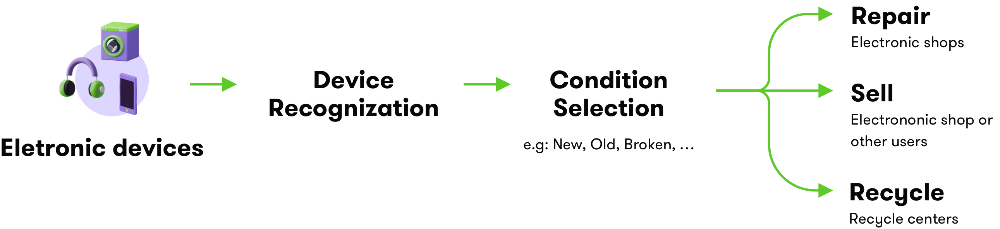
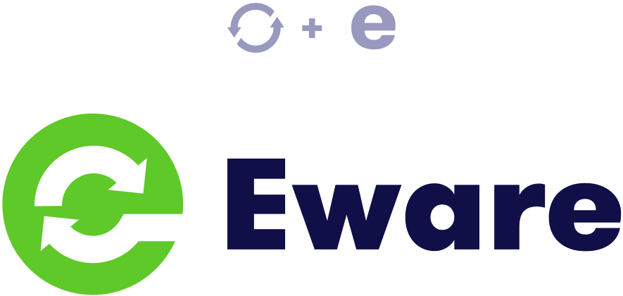
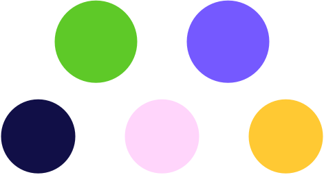
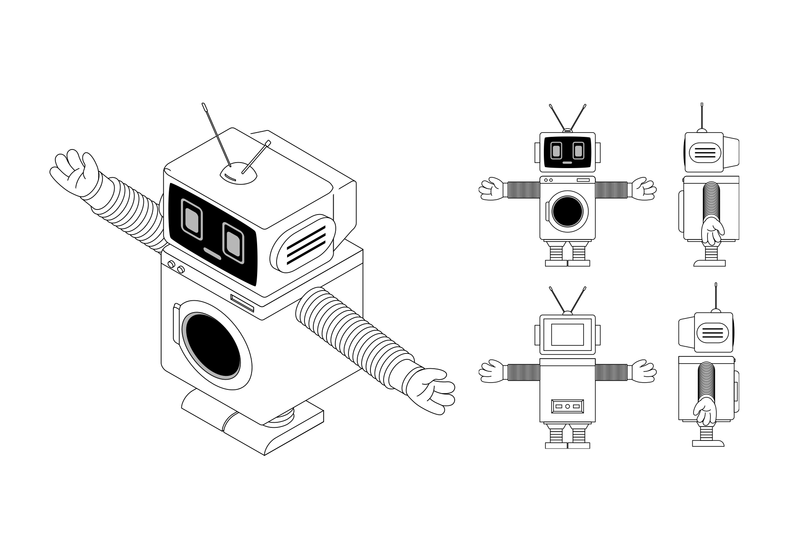
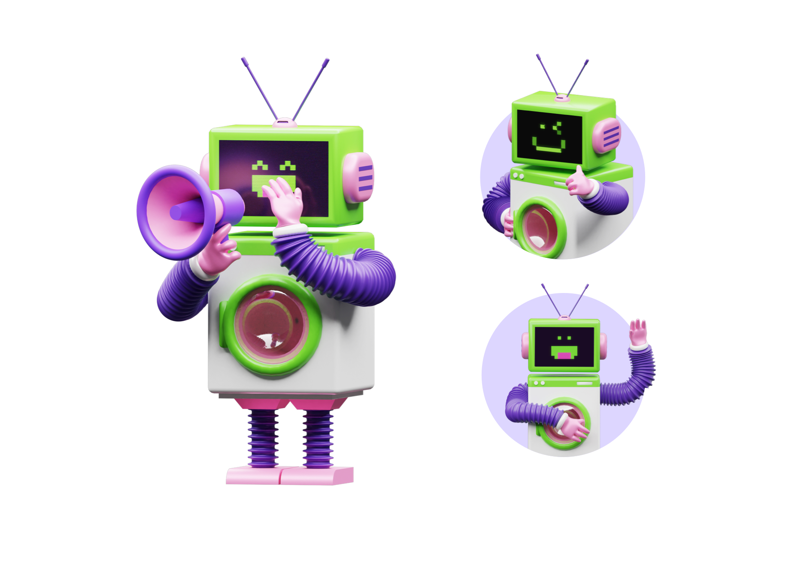
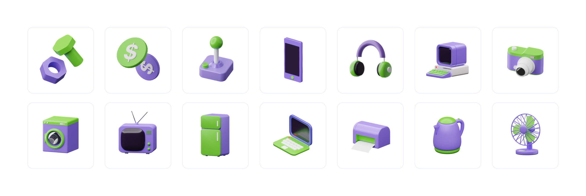
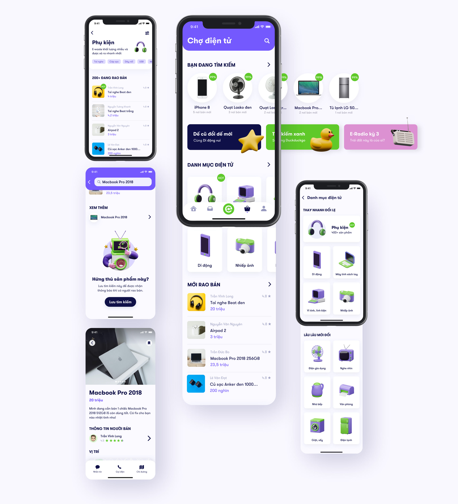
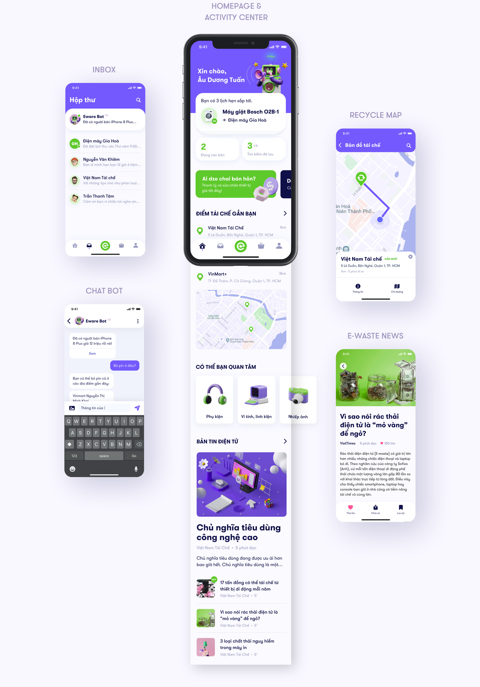

import logo from "./logo.svg"
import booking from "./clips/booking.mp4"
import condition from "./clips/condition.mp4"
import device from "./clips/device.mp4"
import rating from "./clips/rating.mp4"
import onboarding from "./clips/onboarding.mp4"
import login from "./clips/login.mp4"

## ⁉️ Problem

Today, with the development of technology, the life cycle of electronic devices became shorter. As a result, a massive e-waste amount is generated worldwide​​​​​​​ <a target="_blank" rel="noopener noreferrer" href="https://www.theverge.com/21309776/record-amount-ewaste-2019-global-report-environment-health">(via The verge)</a>. While just about 17 percent of that waste is officially recycled, others are discharged into landfills and the ocean <a target="_blank" rel="noopener noreferrer" href="https://www.theverge.com/2019/12/4/20992240/e-waste-recycling-electronic-basel-convention-crime-total-reclaim-fraud">(via The verge)</a>. Realized this, in my graduation thesis, I wonder how we can make a digital product or a platform to alleviate the E-waste problem. Eware came as an answer to this question.

## 🧠 Concept

Eware is a SaaS services connecting users and electronic shops and recycle centers to reduce, reuse and recycle old tech devices or electronic wastes. The goal is to mitigate the negative effect of them on the environment.

<FullWidth>

</FullWidth>

### User Research

I had surveyed more than 200 people in tech & environment-lover groups to get some insights about what they think and need in this project. With that data, I come up with two personas that present two typical user types of this app.

<Grid>
<Col span="6" spanMd="12">

<Persona>
<Grid template="1fr minmax(40px, 140px)">
<Col>

### Thanh Hoa - Officer

#### Age

35 years old

#### Hashtags

#zero-waste #home-addicted #low-tech

</Col>
<Col>
<Avatar>

</Avatar>
</Col>
</Grid>

- Sell stuff to declutter house & upgrade.
- Clean data properly when selling.
- Don’t have much time.
- Difficult in transportation.

</Persona>
</Col>
<Col span="6" spanMd="12">

<Persona>

<Grid template="1fr minmax(40px, 140px)">
<Col>

### Minh Thien - Student

#### Age

35 years old

#### Hashtags

#zero-waste #home-addicted #low-tech

</Col>
<Col>
<Avatar>

</Avatar>
</Col>
</Grid>

- Sell broken devices and buy 2nd stuff to save money.
- Sell and buy with good prize.
- Don’t have much money.
- Don’t know legit shops.

</Persona>
</Col>
</Grid>

## 👀 Branding

### Logo, Colors & Brand voice

Eware is a brand about tech & environment so that I chosen purple and green as primary colors with some supporting colors. The logo is clean, simple but stand-out enough.

The brand voice is bold, funny, and inspirational, which is presented by copywriting. The content uses punchlines, poems, and Vietnamese idioms to make it sound more trendy and intriguing.

<Grid>

<Col span="6" spanMd="12">
<Box caption="Logo">

</Box>

</Col>

<Col span="3" style={{gridRow: 'second-line / 2'}} spanMd="12"><Box caption="Color Palette">

</Box></Col>

<Col span="3" style={{gridRow: 'second-line / 2'}} spanMd="12"><Box caption="App Logo">

</Box></Col>

<Col start="7" span="6" style={{gridRow: '1 / span 2'}} spanMd="12">
<Box caption="Copywriting">

Di động, tủ lạnh, tivi 
Hỏng không dùng nữa vậy thì bán thôi

Cũ người mới ta, chẳng lo về giá

To tủ lạnh, nhỏ tai nghe 
Nếu cần sửa chữa nhanh lẹ có ngay

</Box>
</Col>
</Grid>

### Mascot & 3D Style

The brand has a character to make it more friendly to users. Because of the tech vibe, I decided to create it in 3D style, modeling in Blender. I also had collected and created some icons in the same style to be used in the device categories.

<FullWidth>
<Grid>
<Col span="6" spanMd="12">

<Box caption="Character 1">

</Box>
</Col>
<Col span="6" spanMd="12">
<Box caption="Character 2">

</Box>
</Col>
<Col span="12">
<Box caption="3D Icons">

</Box>
</Col>

</Grid>
</FullWidth>

## 📱 Eware App Walkthrough

### Onboarding & Login

The onboarding flow uses 3D animations and poem-style copy writings to introduce product features. The login flow priorities modern login/registration methods to minimize the number of inputs that the user has to fill.​​​​​​​

<FullWidth>

<Grid>
<Col span="6" spanMd="12">

<Figure caption="Onboarding - 3 short 3D animations with poem-style copy">

<Video src={onboarding} width="1256" height="1604" poster="./clips/onboarding.jpg"></Video>

</Figure>
</Col>
<Col span="6" spanMd="12">

<Figure caption="Login - Able to use Apple ID and memoji">

<Video src={login} width="1256" height="1604" poster="./clips/login.jpg"></Video>

</Figure>
</Col>
</Grid>

</FullWidth>

### Repair/Sell Suggestion

The app makes use of modern technologies to recognize and suggest the best places with the average price to fix or sell electronic devices, based on their conditions, which could be indicated easily in this app.

<FullWidth>

<Grid>
<Col span="6" spanMd="12">

<Figure caption="Device Recognization - Input electric device model">

<Video src={device} width="1256" height="1604" poster="./clips/device.jpg"></Video>

</Figure>
</Col>
<Col span="6" spanMd="12">

<Figure caption="Condition Indication - Pick or search for damaged parts">

<Video src={condition} width="1256" height="1604" poster="./clips/condition.jpg"></Video>

</Figure>
</Col>
</Grid>

</FullWidth>

### Booking & Rating

The app also provides booking feature for repair/sell services, especially for large devices. After a transaction between users and/or electronic shops succeed, there is a rating system to collect data to control the quality of that user/shop.

<FullWidth>

<Grid>
<Col span="6" spanMd="12">

<Figure caption="Booking">

<Video src={booking} width="1256" height="1604" poster="./clips/booking.jpg"></Video>

</Figure>
</Col>
<Col span="6" spanMd="12">

<Figure caption="Rating">

<Video src={rating} width="1256" height="1604" poster="./clips/rating.jpg"></Video>

</Figure>
</Col>
</Grid>

</FullWidth>

## E-Market

The market is where users and electronic shops can sell and buy electronic devices. The product list could be filtered by product model or category. Also, the user can save searches to receive notifications about their favorite products.

<FullWidth>

​​​​​​​

</FullWidth>

### Home and other supporting functions

The homepage also is an activity center that shows what's going on. Some other functions support the transactions or provide information, such as Inbox, Chatbot (Notifications), Recycle map, and E-waste news.​​​​​​​

<FullWidth>

​​​​​​​

</FullWidth>

## 🔥 Full App Demo

> A picture is worth a thousand words. Watch the demo to understand the app easier.

The demo clip presents the main flows and screens of this app, including: Onboarding & Login; Homepage & Maps; Repair/Sell Suggestion with booking and raking; Market, Chatbot and Inbox; Account.

<Vimeo id="450646329" />

## 🖥 Landing Page

I also design the landing page to promote this app. Inspired by Apple, it has the parallax effect, on-scroll 3D animation with some funny but meaningful content to raise people's awareness about the negative effects of E-waste.

<Vimeo id="450657239" />

## ⭐️ Credits

Shout out to my lecturer who has instructed and mentored me to complete this project. Thank Tam Le and An Nguyen for supporting me some parts in this project.

- Mentor: Mrs. Kieu-anh Tran
- Stock Photos: Unsplash, Pixabay, Shutterstock
- 3D Icon base: Superscene by Craftwork
- 2D Icon pack: SF Symbols by Apple
- 3D Model & Animation Support: An Nguyen
- Character Development Support: <a target="_blank" rel="noopener noreferrer" href="https://www.behance.net/tamleart110">Tam Le</a>
