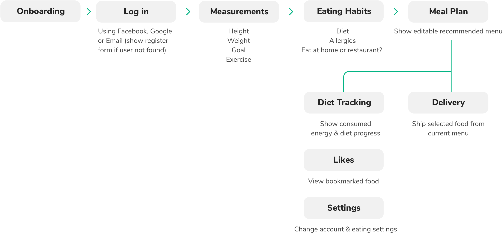
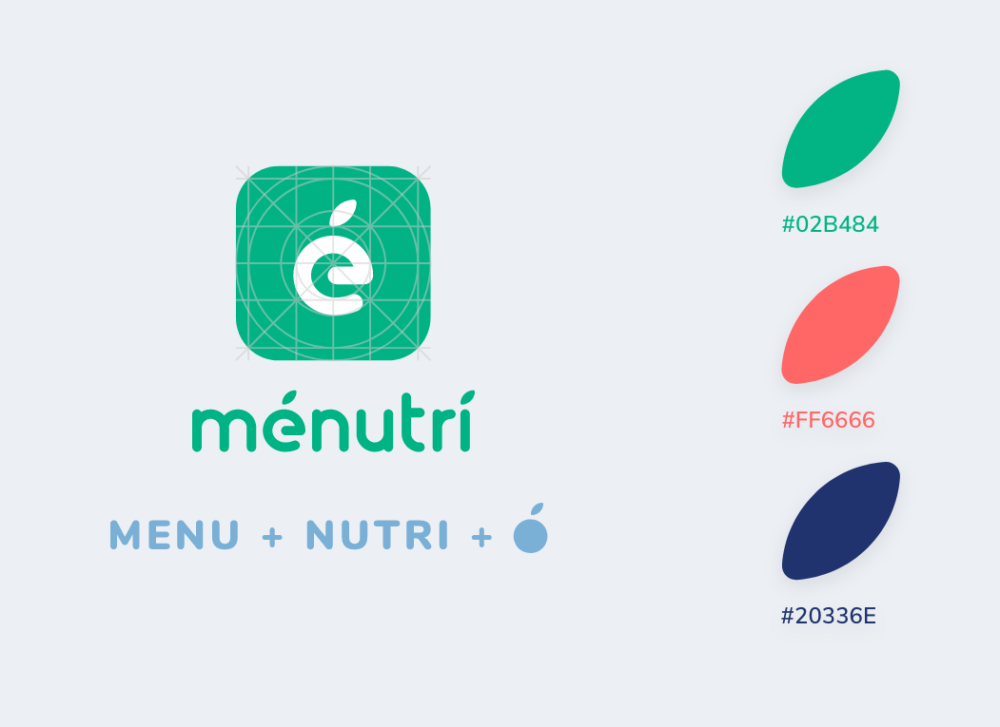
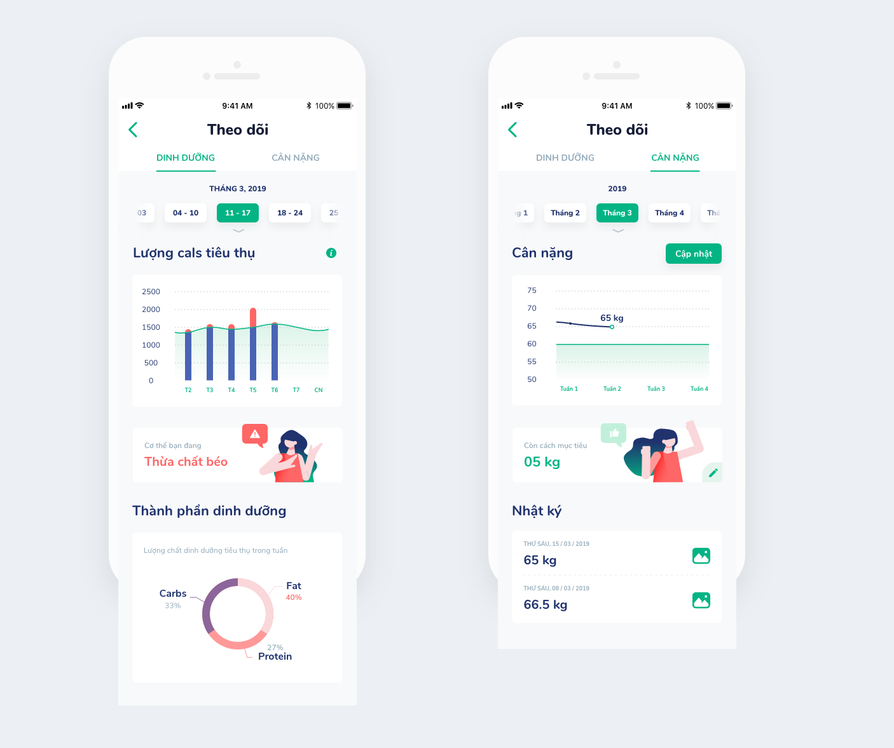

## Features

Menutri is a mobile app that recommends healthy meals based on user personalizations and provides a tracking system of consumed energy and their body status. Also, it comes with a food delivery service for those who do not have time to cook or cannot cook.

<Grid>
<Col span="4" spanMd="12"><Box>
💪

### Body status tracking & analytics

</Box></Col>
<Col span="4" spanMd="12"><Box>
🍽

### Healthy eating plan

</Box></Col>
<Col span="4" spanMd="12"><Box>
🚴‍♂️

### Food delivery

</Box></Col>
</Grid>

## Working Demo

You can view the interactive-demo video below to understand clearly how this app works.

<VideoBox>

<Vimeo id="341094479" />

</VideoBox>

## User Research

Our team had done some interviews and surveys with our friends, moms and conducted 3 personas for our product with different ages, habits and goals.

<Grid>
<Col span="4" spanMd="12">
<Persona>

### Tuan - Student

#### Age range

18-25

#### Focus

Gain weight and healither diet.

#### Habit

Cook at home and order via apps.

</Persona>
</Col>
<Col span="4" spanMd="12">
<Persona>

### Lan - Officer

#### Age range

26-35

#### Focus

Gain weight and healither diet.

#### Habit

Loose weight and diversity in daily meals.

</Persona>
</Col>
<Col span="4" spanMd="12">
<Persona>

### Huong - Housewife

#### Age range

36-50

#### Focus

Healthy and nutrient meals for family.

#### Habit

Cook at home.

</Persona>
</Col>
</Grid>

With these personas, we know what and how we should focus on when designing this app.

## User Flow

The chart below summaries the flow to use this app, which begins with the onboarding, login, then personalization settings, meal plan, finally food delivery and body tracking.

<FullWidth>

</FullWidth>

## Branding

The branding is bold, young and clean. The logo is simple, which is a combination of fruit icon and "e". Also, it comes with a trendy illustration style to make the app more friendly.

<!-- <FullWidth>

</FullWidth> -->

## Personalize

To provide the best diet-meal recommendations, Menutri personalization section allows the user to add customizations based on body goals, religions, and eating habits.

<FullWidth>

<Grid>
<Col span="6" spanMd="12">

<Figure caption="The user can input their current height and weight.">
{/* 
<Video src={measurementandgoal} width="720" height="1000"></Video> */}

</Figure>

</Col>
<Col span="6" spanMd="12">
<Figure caption="The religion-based food recommendation is available too.">

</Figure>

</Col>
</Grid>

</FullWidth>

## Meal Planning

On the home screen, there is already a planned menu every day. If any dish in the menu is not appropriate, Menutri will recommend an alternative. The user can also drag the timeline to view their eating history and add what they had eaten outside the recommended menu.

<FullWidth>

<Grid>
<Col span="6" spanMd="12">

<Figure caption="Homescreen - Recommeded meal plan">

</Figure>

</Col>
<Col span="6" spanMd="12">

<Figure caption="Meal selector - 3 methods: Recipe, Order, Input">

</Figure>

</Col>
</Grid>

</FullWidth>

## Diet Tracking

Menutri also comes with a diet tracking system that helps track body status and suggests how to improve it.

<Grid>
<Col span="6" spanMd="12">

<Figure caption="Diet tracking - Nutrient (Carbs, Fat, Protein)">

</Figure>

</Col>
<Col span="6" spanMd="12">

<Figure caption="Diet tracking - Weight">

</Figure>

</Col>
</Grid>

## Delivery

Of course, it comes with the built-in delivery service, where the service can get income.

<Grid>
<Col span="6" spanMd="12">

</Col>
<Col span="6" spanMd="12">

</Col>
<Col span="6" spanMd="12">

</Col>
<Col span="6" spanMd="12">

</Col>
</Grid>
